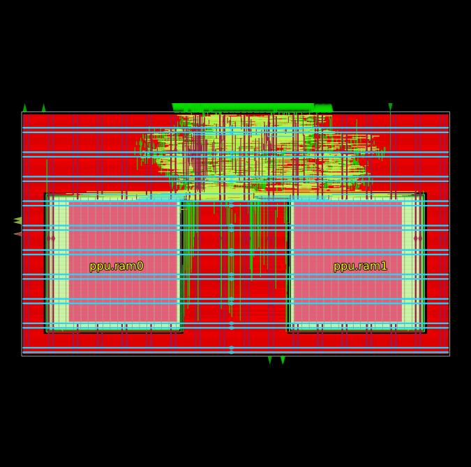
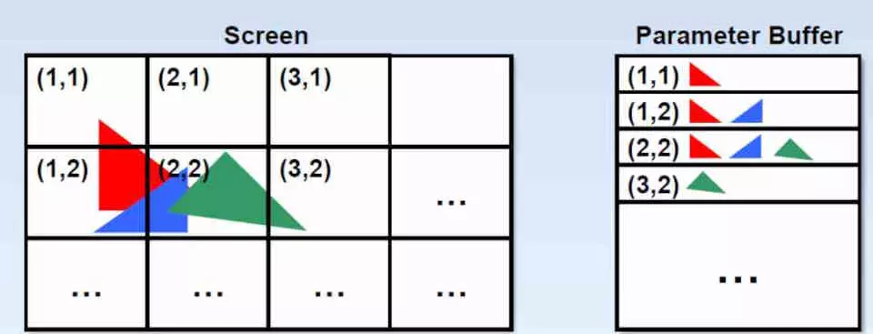
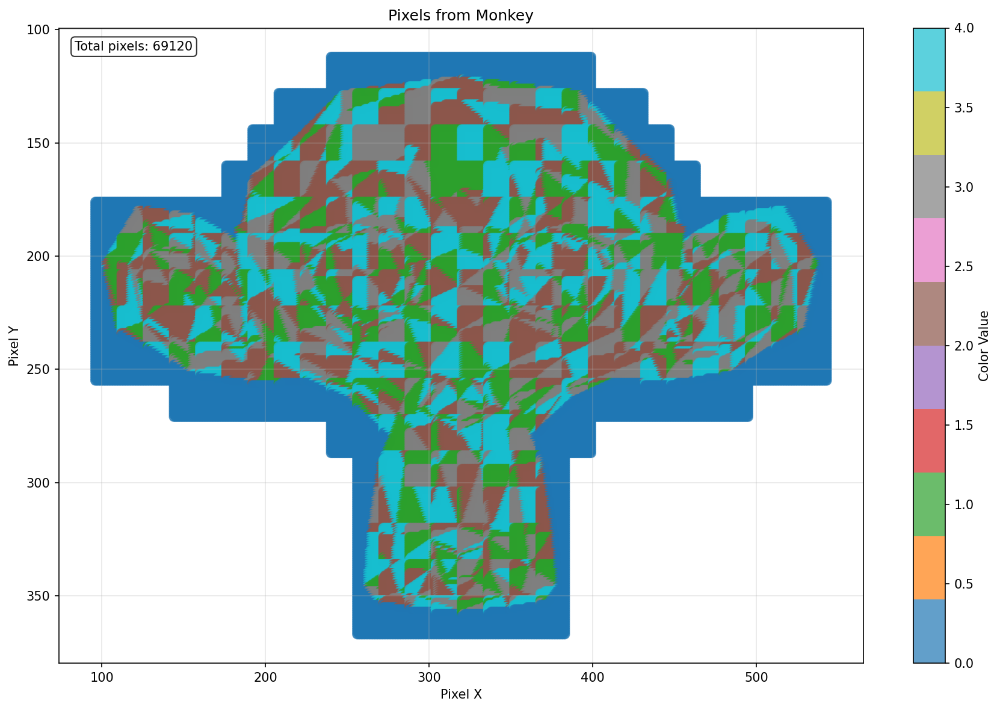

<h1 align="center">CPE 470 Final Project - Rasterizer</h1>
<p align="center">Created by Riley Peters and Srinivas Sundararaman</p>


## Description

A simple IC that determines the shading of pixels on a 640x480 VGA monitor with 8-bit color based on polygon vertices. 
To minimize the memory footprint, polygons are rasterized in groups of 16x16 screen tiles.
This requires the host processor to send polygons repeatedly for each region they overlap.

<figure>
  
  <figcaption align="center">Final IC Layout</figcaption>
</figure>

## Components

### Tile Processor

The Tile Processor (/rtl/tile_processor.sv) handles expensive computations that need to occur only once per polygon.
These steps require multiplication and division; however, once they are complete we can pass the result to a separate
module that handles the individual pixels.

Key Features:
- Multiplication and division are handled by low-resource, multi-cycle modules (/rtl/lp_div.sv and /rtl/lp_mul.sv) to reduce the hardware footprint and critical path length
- Computes the intial value of the edge function E(x,y) at the top-left corner of the tile
- Computes the partial derivatives dz/dx and dz/dy, as well as the value of z at the top-left corner of the tile

<figure>
  
  <figcaption align="center">Diagram of our Tile-based Rasterization Process</figcaption>
</figure>

### Pixel Processor

The Pixel Processor (/rtl/pixel_processor.sv) receives the base values from the Tile Processor, and incrementally updates them to test whether each pixel should be visible.
This portion of the design only needs to incrementally update the original data with addition and subtraction, allowing it to complete its task at a similar rate to the Tile Processor.

Key Features:
- Uses two 128x32 [DFFRAM Macros](https://github.com/efabless/OL-DFFRAM) to store intermediate tile depth and color values 
- Pipelines RAM reads and writes to ensure that the module takes 1 cycle per pixel
- Flushes the stored tile data upon receiving values from a different tile. These values are formatted to be sent to an external framebuffer

## Building and Testing

### Dependencies

- Dependencies for simulating and building such as Verilator, IVerilog, Openlane, and Openroad can be installed through the [Yosys OSS CAD Suite](https://github.com/YosysHQ/oss-cad-suite-build)

- The CocoTB tests, which visualize the result of running the Rasterizer, require pywavefront, cocotb, matplotlib, and numpy. These should be installed using a Python Virtual Environment

#### Setting up Venv for CocoTB
```
git clone '<'project'>'
cd '<'project'>'
python -m venv .venv
source .venv/bin/activate
pip install pywavefront cocotb matplotlib numpy
```

### Running Tests

In the home directory:

Run SystemVerilog Tests contained in the /tests directory with the Verilator simulator using:
> make tests

Run SystemVerilog Tests contained in the /tests directory with the IVerilog simulator using:
> make itests

Run CocoTB Tests contained in the /cocotests directory to visualize polygons using:
> make cocotests

Intermediate files created while testing can be cleaned with the command:
> make clean

<figure>
  
  <figcaption align="center">Output of Rasterizing the Blender Monkey. Produced by CocoTB Tests.</figcaption>
</figure>

## Openlane Chip Synth

If you want to test building the final IC, run the following command:
> make openlane

It will take around an hour to complete, and can be visualized afterward with the command:
> make openroad